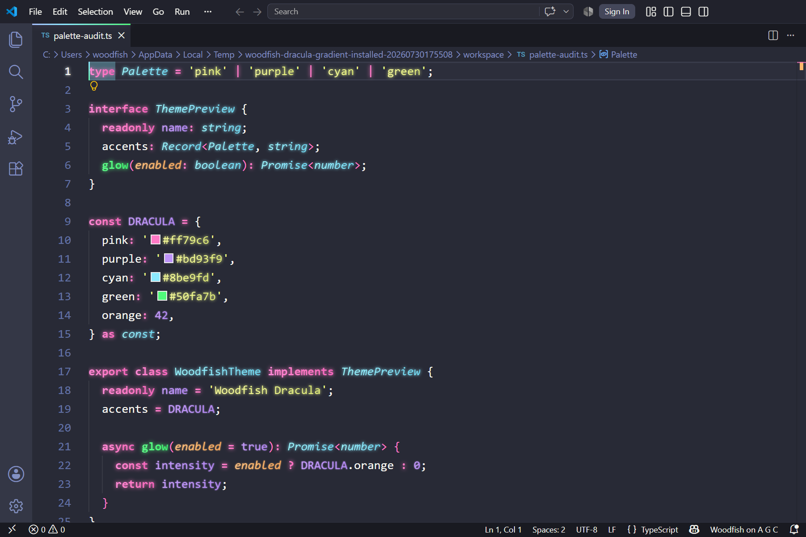

# Woodfish Theme

> English | [中文](README.md)

Woodfish Theme 6 is a universal VS Code visual overlay. It keeps the active color theme's original token colors, then derives OKLCH gradients, glow, and an optional rainbow cursor at runtime. The bundled Bearded and Dracula themes are optional bases, not requirements.

[](https://github.com/woodfishhhh/Woodfish-Theme)
[](THIRD_PARTY_NOTICES.md)
[](https://code.visualstudio.com/)

## Features

- Universal overlay for any VS Code color theme
- Per-token gradients derived from the active theme's computed colors
- Glow effects
- Optional rainbow cursor (via CSS injection)
- Validated atomic workbench updates with version-aware backups and rollback
- Reduced-motion fallbacks for continuous effects
- Modular CSS structure

## New in 6.0 beta

- **Theme-independent overlay**: Switching color themes no longer pauses or removes Woodfish.
- **Stable token discovery**: The runtime discovers Monaco token spans without hard-coding `mtk` ids.
- **Approved defaults**: Hue shift `±24°`, lightness `ΔL ±0.060`, and gradient angle `90°`.
- **Neutral-color treatment**: White and gray tokens borrow an accent hue from the active theme, so default foreground text also receives visible gradient and glow.
- **Original bundled bases**: `Woodfish Dark` and `Woodfish Dracula` now contain unmodified upstream theme colors.


## Preview



The overlay automatically derives an OKLCH gradient from every token's current computed color. The original color stays at the midpoint, while `ΔL ±0.060` and a `±24°` hue shift create the endpoints before they are mapped to concrete sRGB values for older VS Code engines. Low-chroma text gets an accent hue from the current theme, and punctuation receives a weaker glow. The screenshot uses the bundled Dracula base, but the same overlay works with third-party themes.

<details>
<summary><strong>View Woodfish Dark previews</strong></summary>


</details>

## Installation

### Install from VS Code Marketplace

1. Open VS Code
2. Press `Ctrl+Shift+X`
3. Search “Woodfish Theme”
4. Install

### Install from VSIX

```bash
code --install-extension woodfish-theme-6.0.0-beta.1.vsix
```

## Runtime Model

Woodfish Theme now ships with an integrated runtime injector and no longer depends on third-party CSS loader extensions.

Runtime behaviors are handled internally:

- the overlay is enabled by default and preserves the currently selected color theme
- startup checks whether the full CSS and bootstrap payload still match
- theme changes trigger a fresh token-color profile without fixed token ids
- known legacy Woodfish payloads are taken over before the new payload is injected
- unknown third-party payloads are not modified automatically
- workbench updates are validated before an atomic replacement, and repair or complete disable only restores a backup that matches the current VS Code installation

## Usage

### Enable / Disable

- `Woodfish Theme: 开启 Woodfish 通用叠层` (enable)
- `Woodfish Theme: 关闭 Woodfish 通用叠层` (disable)

Reload the VS Code window when prompted.

### Optional Bundled Themes

1. Press `Ctrl+K Ctrl+T`
2. Select “Woodfish Dark” or “Woodfish Dracula”
3. Woodfish keeps that original base and applies the same universal overlay on top

Enabling or disabling the overlay never changes the selected color theme. When cursor settings are untouched, Woodfish Dracula uses a 12-second pink-purple-cyan-green loop, a `1px` radius, and `0.45` trail opacity. Explicit `woodfishTheme.cursor.*` values always win.

### Rainbow Cursor

- `Woodfish Theme: 开启 Woodfish 彩色光标`
- `Woodfish Theme: 开启/关闭彩色光标`

### Status Bar Meanings

- `on`: the universal overlay is enabled and its current payload is present
- `paused`: overlay effects are enabled but the current payload is missing, usually pending repair or reload
- `off`: the overlay master switch is disabled, or all effect layers are disabled
- `A`: syntax gradient
- `G`: glow
- `C`: rainbow cursor

### Other Commands

- `Woodfish Theme: 开启/关闭 Woodfish 发光`
- `Woodfish Theme: 彻底停用 Woodfish 叠层` (best-effort cleanup, will ask for confirmation)

## ❓ Troubleshooting

If you encounter issues, please try the following steps. For more details, see the [Full Troubleshooting Guide](docs/TROUBLESHOOTING.md).

- **Issue: Glow effects are not showing**
  - Reason: The updated workbench payload is installed, but the current window has not been reloaded yet.
  - Solution: After running the enable command, make sure to click **"Reload Window"** in the notification.
- **Issue: Effects persist after deactivation**
  - Reason: Cached CSS or leftovers from previous versions.
  - Solution: Run the `Woodfish Theme: 彻底停用 Woodfish 叠层` command to clean up residues.
- **Issue: Status bar is not visible**
  - Reason: The extension is not yet activated.
  - Solution: Run any `Woodfish Theme:` command (for example, "开启 Woodfish 通用叠层") to activate the extension.
- **Issue: Rainbow cursor not working**
  - Reason: The overlay or cursor layer is disabled, or the window has not been reloaded after injection.
  - Solution: Enable both layers, then reload the window. Any color theme is supported.
- **Issue: The status bar says `paused`**
  - Reason: Effect layers are enabled, but the matching payload is missing.
  - Solution: Run `Woodfish Theme: 修复 Woodfish 注入`, then reload the window.

## 💬 FAQ

- **Q: Why is a reload required every time I toggle a feature?**
  - A: CSS injection modifies the VS Code UI layer, which requires a window reload to process the updated stylesheets.
- **Q: Can I keep my existing color theme?**
  - A: Yes. Version 6 is specifically designed to overlay any active VS Code color theme.
- **Q: How do I completely remove all effects?**
  - A: Use `Woodfish Theme: 彻底停用 Woodfish 叠层` to remove the current payload and clean up known legacy Woodfish fragments.
- **Q: What do `on / paused / off / A / G / C` mean in the status bar?**
  - A: `on / paused / off` are the real runtime states. `A` = syntax gradient, `G` = glow, `C` = rainbow cursor.

## Configuration

```json
{
  "woodfishTheme.overlay.enabled": true,
  "woodfishTheme.overlay.hueShift": 24,
  "woodfishTheme.overlay.lightnessDelta": 0.06,
  "woodfishTheme.overlay.neutralChroma": 0.06,
  "woodfishTheme.overlay.angle": 90,
  "woodfishTheme.syntaxGradient.enabled": true,
  "woodfishTheme.glow.intensity": 0.8,
  "woodfishTheme.cursor.gradientStops": [
    "#ff2d95",
    "#ffd700",
    "#00ffff"
  ],
  "woodfishTheme.cursor.glowBlur": 0,
  "woodfishTheme.cursor.glowOpacity": 0.55,
  "woodfishTheme.cursor.customRules": [
    "div.cursor { width: 3px !important; }"
  ]
}
```

### Recommended Setting Map

- `woodfishTheme.overlay.enabled`
  - Persistent master switch for the universal overlay. Defaults to `true`.
- `woodfishTheme.overlay.hueShift`
  - Hue offset for both gradient endpoints in degrees. Defaults to `24`.
- `woodfishTheme.overlay.lightnessDelta`
  - OKLCH lightness offset. Defaults to `0.06`.
- `woodfishTheme.overlay.neutralChroma`
  - Chroma added to white and gray tokens. Defaults to `0.06`.
- `woodfishTheme.overlay.angle`
  - Text-gradient direction in degrees. Defaults to `90`.
- `woodfishTheme.syntaxGradient.enabled`
  - Turns the syntax color layer on or off.
- `woodfishTheme.syntaxGradient.customRules`
  - Appends custom token CSS after the default gradient layer.
- `woodfishTheme.glow.enabled`
  - Enables or disables the glow layer.
- `woodfishTheme.glow.intensity`
  - Multiplier in the `0.1 - 3` range. Internally scales the default glow blur radius.
- `woodfishTheme.cursor.animationDuration`
  - Measured in seconds. Smaller values make the cursor cycle faster.
- `woodfishTheme.cursor.gradientStops`
  - The core color band for the rainbow cursor. Each item is a CSS color value.
- `woodfishTheme.cursor.borderRadius`
  - Measured in `px`. Controls cursor roundness.
- `woodfishTheme.cursor.glow`
  - Toggles cursor trail glow.
- `woodfishTheme.cursor.glowBlur`
  - Measured in `px`. Defaults to `0` for a filter-free trail; values above `0` explicitly opt into blur.
- `woodfishTheme.cursor.glowOpacity`
  - Range `0 - 1`. Controls how visible the trail is.
- `woodfishTheme.cursor.customRules`
  - Final override layer for advanced cursor tweaks.

Custom rule arrays accept up to 32 entries, 4096 characters per entry, and 16384 characters in total. Rules containing `</style`, `<script`, `@import`, or `url(...)` are ignored. VS Code restricts custom CSS and cursor gradient settings in untrusted workspaces; the remaining safe settings continue to work.

## Development

```bash
npm install
npm run compile
npm test
npm run test:integration
npm run lint
npm run format
npm run format:check
npm run verify
npm run package
```

## Changelog

See [CHANGELOG.md](CHANGELOG.md).

## License

Woodfish extension code is MIT licensed. The bundled Bearded base is GPL-3.0-only and the bundled Dracula base is MIT licensed. See [THIRD_PARTY_NOTICES.md](THIRD_PARTY_NOTICES.md).
